WasmEdge Pre-Test for LFX [[3172](https://github.com/WasmEdge/WasmEdge/issues/3172)]
---
This is the pretest for WasmEdge Linux Mentorship Project. I am using `Ubuntu 22.04.3 LTS x86_64 ` machine for performing this pretest. 
<!-- TOC start (generated with https://github.com/derlin/bitdowntoc) -->

- [1. Setting up Development Environment](#1-setting-up-dev-environ)
    * [Init Project](#install-rust)
- [2. Burn Pretest](#2-burn-pretest)
    * [Init Project](#init-project)
    * [Burn Example Code](#burn-example-code)
    * [Build and Run](#build-and-run)
    * [MNIST Example With WGPU](#mnist-wgpu)
    * [MNIST Example With NDARRAY](#mnist-ndarray)
- [3. Build WasmEdge Rustls Plug-in](#3-build-wasmedge-rustls-plug-in)
    * [Install Wasmedge](#install-wasmedge)
    * [Build and Install](#build-and-install)
- [4. Example with WasmEdge Rustls Plug-in](#4-example-with-wasmedge-rustls-plug-in)
    * [WasmEdge Hyper Demo](#wasmedge-hyper-demo)
        + [Prerequisites](#prerequisites-1)
        + [Build and Run](#build-and-run-1)

<!-- TOC end -->

<!-- TOC --><a name="1-setting-up-dev-environ"></a>
# 1. Setting up Development Environment
<!-- TOC --><a name="install-rust"></a>
## Install Rust and Cmake

```shell
curl --proto '=https' --tlsv1.2 -sSf https://sh.rustup.rs | sh
sudo apt  install cmake
```

<!-- TOC --><a name="2-burn-pretest"></a>
# 2. Burn Pretest

>Reference: [https://burn.dev/book/getting-started.html](https://burn.dev/book/getting-started.html)
<!-- TOC --><a name="init-project"></a>
## Init Project

Initializing burn_app, navigating to its directory and adding backends like `wgpu`, `candle`, `tch`, `ndarray`. For this demonstration, we will use the `wgpu` backend.
```shell
cargo new burn_app
cd burn_app
cargo add burn --features wgpu
```
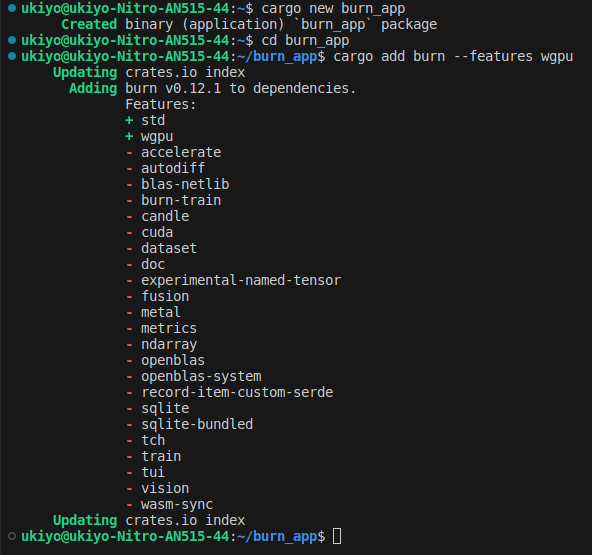

<!-- TOC --><a name="burn-example-code"></a>
## Burn Example Code

Update `./burn_app/src/main.rs` with the following code:

```rust
use burn::tensor::Tensor;
use burn::backend::Wgpu;

// Type alias for the backend to use.
type Backend = Wgpu;

fn main() {
    let device = Default::default();
    // Creation of two tensors, the first with explicit values and the second one with ones, with the same shape as the first
    let tensor_1 = Tensor::<Backend, 2>::from_data([[2., 3.], [4., 5.]], &device);
    let tensor_2 = Tensor::<Backend, 2>::ones_like(&tensor_1);

    // Print the element-wise addition (done with the WGPU backend) of the two tensors.
    println!("{}", tensor_1 + tensor_2);
}
```

<!-- TOC --><a name="build-and-run"></a>
## Build and Run

```shell
cargo build
cargo run
```
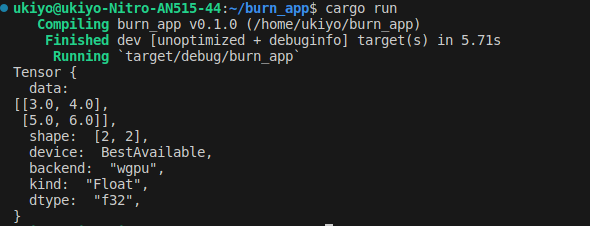

<!-- TOC --><a name="mnist-wgpu"></a>
## Run MNIST example with wgpu backend

``` shell
cd burn/examples/mnist
cargo run --example mnist --release --features wgpu
```
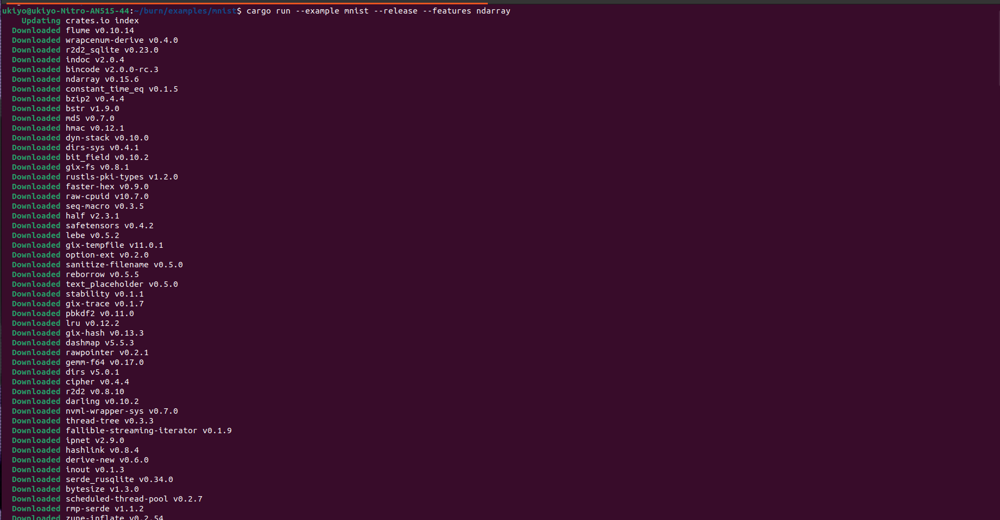
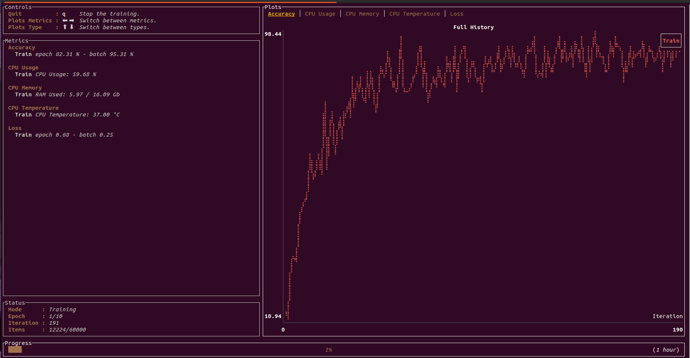

<!-- TOC --><a name="mnist-ndarray"></a>
## Run MNIST example with wgpu ndarray

```shell
cd burn/examples/mnist
cargo run --example mnist --release --features ndarray
```
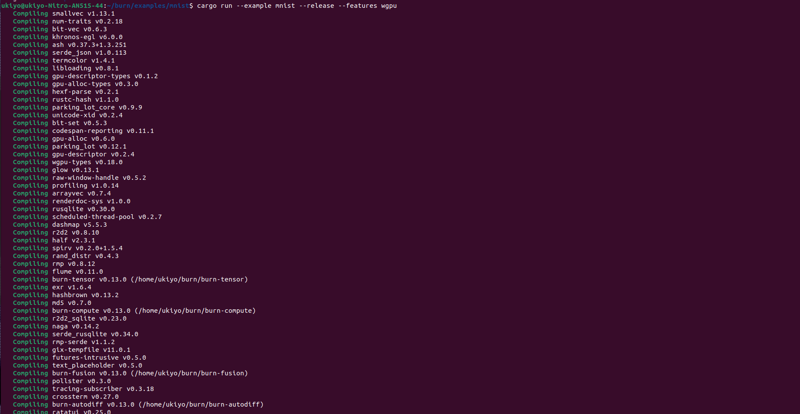
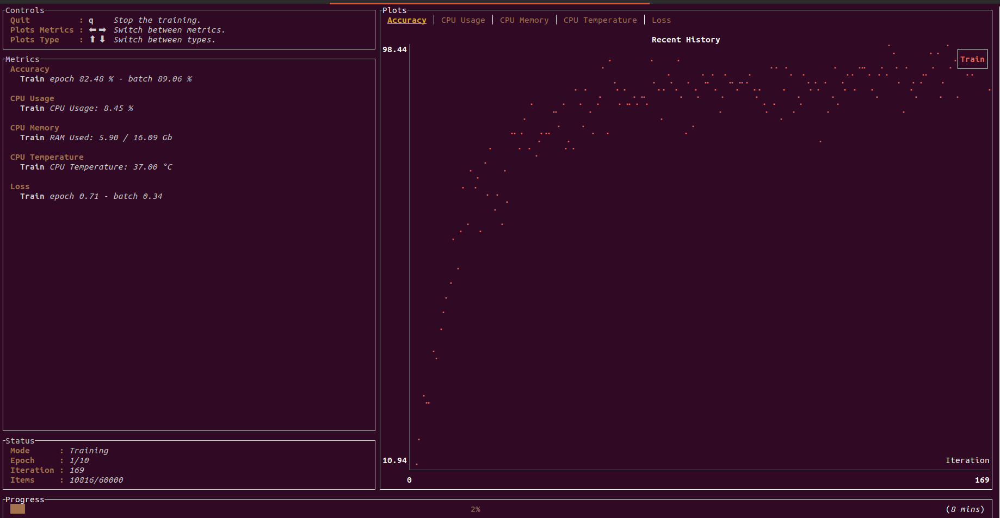

<!-- TOC --><a name="3-build-wasmedge-rustls-plug-in"></a>
# 3. Build WasmEdge Rustls Plug-in

<!-- TOC --><a name="build-and-install"></a>
## Build and Install Rustls

```shell
git clone https://github.com/WasmEdge/WasmEdge
git checkout hydai/0.13.5_ggml_lts
cd WasmEdge/plugins/wasmedge_rustls
```
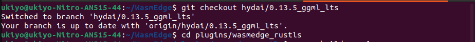

<!-- TOC --><a name="install-wasmedge"></a>
## Install WasmEdge

Install wasmedge first to avoid the mistake [https://github.com/WasmEdge/WasmEdge/issues/2303](https://github.com/WasmEdge/WasmEdge/issues/2303), 
```shell
curl -sSf https://raw.githubusercontent.com/WasmEdge/WasmEdge/master/utils/install.sh | bash
source $HOME/.wasmedge/env
```
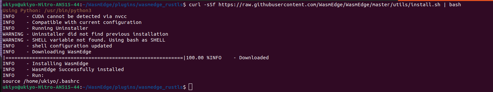

Now, install `rustls` plugin.
```shell
cp target/release/libwasmedge_rustls.so  ~/.wasmedge/plugin/
cargo build --release
```
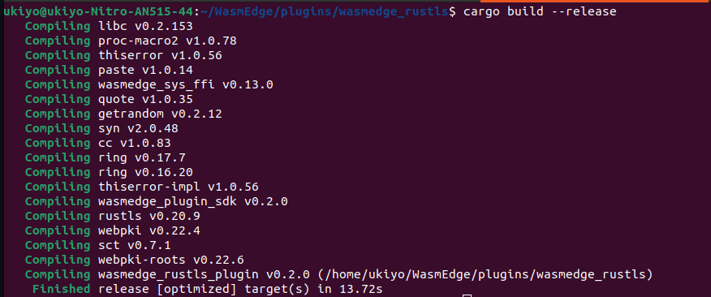

<!-- TOC --><a name="4-example-with-wasmedge-rustls-plug-in"></a>
# 4. Example with WasmEdge Rustls Plug-in

<!-- TOC --><a name="wasmedge-hyper-demo"></a>
## Use `wasmedge_hyper_demo` to test wasmedge_rustls plugin
> Ref: https://github.com/WasmEdge/wasmedge_hyper_demo

<!-- TOC --><a name="prerequisites-1"></a>
### Prerequisites

```shell
# Install wasm/wasi target 
rustup target add wasm32-wasi
```

<!-- TOC --><a name="build-and-run-1"></a>
### Build and Run

```shell
git clone https://github.com/WasmEdge/wasmedge_hyper_demo
cd client-https/
cargo build --target wasm32-wasi --release
```
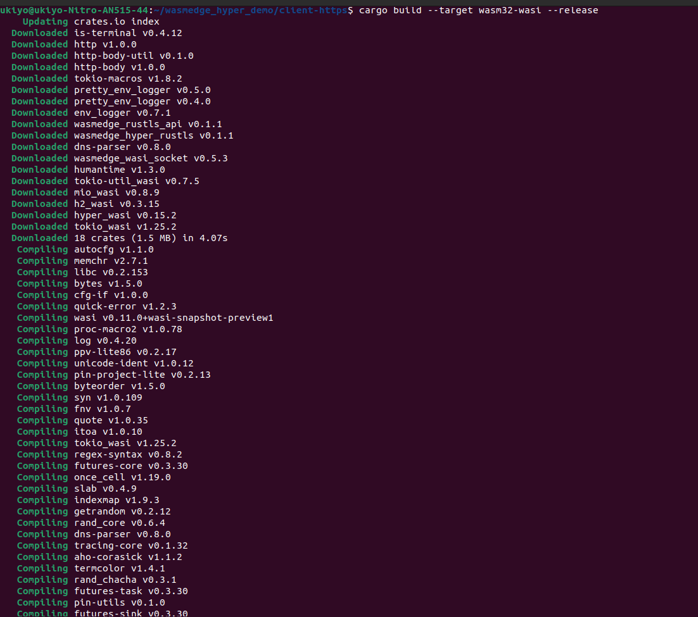
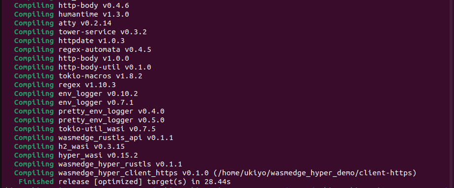

### Run the client example

```shell
wasmedge compile target/wasm32-wasi/release/wasmedge_hyper_client.wasm wasmedge_hyper_client_https.wasm
```
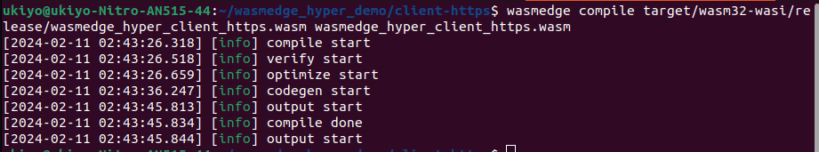


